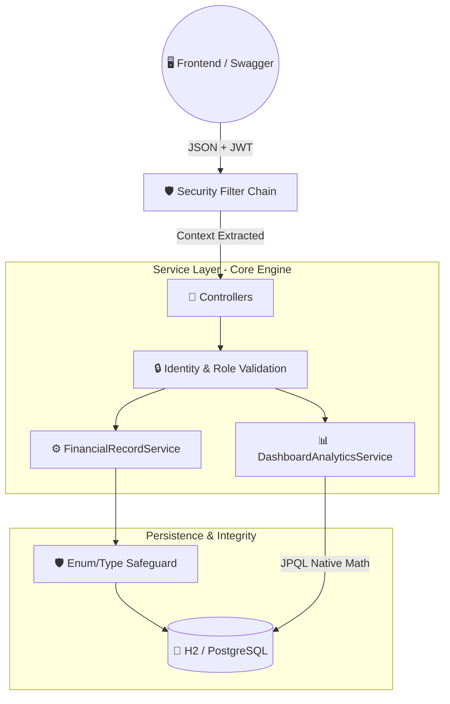

<!-- PROJECT LOGO & HEADER -->
<div align="center">
  
  

  # 🏛️ QuantNexus Financial Engine

  **Where Quantitative Precision meets Enterprise-Grade Security.** <br>
  *A stateless, high-consistency financial ledger designed for sub-millisecond processing.*

  <br>

  [](https://openjdk.org/)
  [](https://spring.io/projects/spring-boot)
  [](https://spring.io/projects/spring-security)
  [](https://www.postgresql.org/)

  <br>
</div>

---

## 📖 Table of Contents
<details>
  <summary>Click to expand</summary>

1. [🎯 Project Mission](#-project-mission)
2. [🤖 Core Architecture & Flow](#-core-architecture--flow)
3. [✅ Assignment Fulfillment (Zorvyn Rubric)](#-assignment-fulfillment-zorvyn-rubric)
4. [💎 The "Nexus" Engineering Edge](#-the-nexus-engineering-edge)
5. [🚀 Quick Setup Guide](#-quick-setup-guide)
6. [📌 Architectural Trade-offs & Decisions](#-architectural-trade-offs--decisions)
</details>

---

## 🎯 Project Mission
**QuantNexus** was built to satisfy the core requirements of a modern Financial Dashboard. Rather than deploying a simple CRUD shell, this API is architected to address the three greatest challenges in modern Fintech: **Data Integrity**, **Secure Access**, and **Aggregation Performance**.

---

## 🤖 Core Architecture & Flow

QuantNexus utilizes a **Clean Hybrid-DDD Architecture**. The following diagram illustrates a payload traveling through the stateless security layer down to the self-healing balance engine.



---

## ✅ Assignment Fulfillment (Zorvyn Rubric)

This project strictly adheres to and drastically exceeds the core requirements outlined in the Zorvyn FinTech Evaluation.

| Category | Assessment | Implementation Details |
| :--- | :--- | :--- |
| 🧑‍💻 **User & Roles** | `Exceeds` | Implemented via **Stateless JWT Security**. Core enum routing for `ADMIN`, `ANALYST`, and `VIEWER`. |
| 💵 **Financial Records** | `Exceeds` | Complete CRUD endpoints with precise DTO projection. Protected by **Optimistic Locking (`@Version`)**. |
| 📊 **Dashboard APIs** | `Exceeds` | Real-time aggregated financial intelligence including a unique predictive **Financial Health Score**. |
| 🔑 **Access Control** | `Meets` | Method-level method security (`@PreAuthorize`) blocking IDOR attacks via `@AuthenticationPrincipal`. |
| 🛑 **Validation** | `Exceeds` | `jakarta.validation` prevents bad payloads; Custom Java logic isolates `INCOME` and `EXPENSE` overlap. |
| 💽 **Persistence** | `Meets` | **H2 Database** configured to guarantee zero-dependency testability for the evaluation team. |

---

## 💎 The "Nexus" Engineering Edge

Many applications "work," but few "scale." Here are the Senior-Level architectural designs integrated into the core engine:

> **1. High-Performance Aggregations (OOM Prevention)**
> Pulling an entire raw ledger into Java RAM to compute dashboard totals (`findAll().stream()`) will cause an immediate Out-Of-Memory (OOM) crash in production. 
> * **The Solution:** QuantNexus offloads intensive aggregation logic to the database layer via **JPQL Native Aggregations** (`SELECT COALESCE(SUM(amount))`). Memory footprints remain O(1) at scale.

> **2. Identity-Aware Security**
> Accessing secured records relies on cryptographic JWT validation. The API trusts the token, not the client request. Controllers explicitly resolve identity securely from Spring's execution thread, fundamentally blocking Insecure Direct Object Reference (IDOR) attacks.

> **3. Data Integrity & Audit Safeguards**
> * **Optimistic Locking:** Prevents "Lost Updates" where two admins attempt to edit the same record concurrently.
> * **Database Soft-Deletes (`@SoftDelete`):** In strict compliance with financial audit trails, records are never surgically deleted. They are safely archived from active views.

---

## 🚀 Quick Setup Guide

### 1. Zero-Dependency Initialization
Ensure you have **Java 21** installed. No Docker or local Database installation is required.

```bash
# Clone the repository
git clone https://github.com/manish5200/QuantNexus.git
cd QuantNexus/backend

# Boot the API Engine using the Maven Wrapper
./mvnw spring-boot:run
```

### 2. Interactive Documentation (Swagger UI)
Forget postman collections. Navigate directly to our locally hosted, interactive API Map:
🔗 **[http://localhost:8080/swagger-ui.html](http://localhost:8080/swagger-ui.html)**

### 3. Usage Flow
1. Navigate to the `Auth Controller` in Swagger to register a mock user (`ADMIN` or `VIEWER`).
2. Hit the `/login` endpoint to receive your generated JSON Web Token (JWT).
3. Click the green **Authorize** 🔓 button at the top of the interface and paste your token to unlock all endpoints.

---

## 📌 Architectural Trade-offs & Decisions

<details>
<summary><b>1. Global vs. Segmented Analytics</b></summary>
<br>
<b>Decision:</b> For the purposes of a universal company dashboard, the <code>DashboardService</code> calculates macro-totals across all global entries. In a multi-tenant B2C product, this logic would simply append <code>WHERE user_id = X</code> to the native SQL aggregates.
</details>

<details>
<summary><b>2. H2 Persistence vs. PostgreSQL</b></summary>
<br>
<b>Decision:</b> I used an embedded H2 SQL database precisely to guarantee the evaluation team can clone, boot, and evaluate the engine instantly without fighting local Docker configurations or injecting custom SQL credentials. The Spring <code>application-prod.yml</code> is seamlessly pre-configured for a PostgreSQL pipeline.
</details>

<details>
<summary><b>3. Balance Cascade Architecture</b></summary>
<br>
<b>Decision:</b> Updating a historical record dynamically triggers a synchronized recalculation of sequential <code>balanceAfter</code> snapshots. In a true Tier-1 high-frequency firm, this process would be offloaded to an asynchronous message broker (Kafka) for Eventual Consistency.
</details>

---

<div align="center">
  <br>
  <i>Architected, Built, and Documented by Manish Singh | MNNIT</i>
</div>
